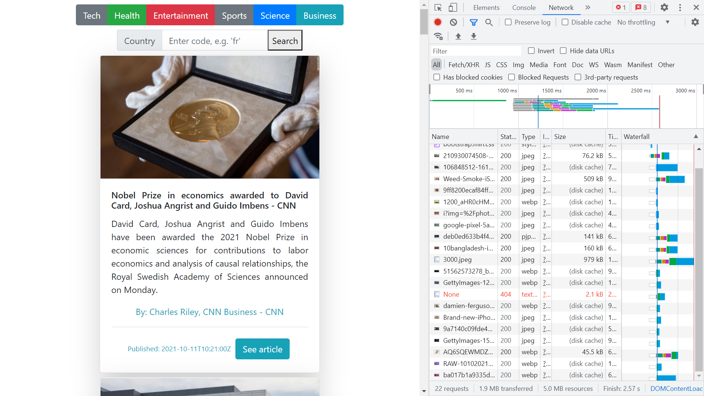

# :zap: Python Django APIView

* Displays news data from a REST API built using Python and the Django framework

## :page_facing_up: Table of contents

* [:zap: Python Django API](#zap-python-django-api)
  * [:page_facing_up: Table of contents](#page_facing_up-table-of-contents)
  * [:books: General info](#books-general-info)
  * [:camera: Screenshots](#camera-screenshots)
  * [:signal_strength: Technologies](#signal_strength-technologies)
  * [:floppy_disk: Setup](#floppy_disk-setup)
  * [:computer: Code Examples](#computer-code-examples)
  * [:cool: Features](#cool-features)
  * [:clipboard: Status & To-do list](#clipboard-status--to-do-list)
  * [:clap: Inspiration](#clap-inspiration)
  * [:envelope: Contact](#envelope-contact)

## :books: General info

* NewsAPI provides data, based on category or country user inputs

## :camera: Screenshots



## :signal_strength: Technologies

* [Python v3](https://www.python.org/) programming language
* [Django v3](https://www.djangoproject.com/) web framework
* [Bootstrap CDN v5.1.2](https://www.bootstrapcdn.com/) CSS link added to html head
* [Bootstrap v5 cards](https://getbootstrap.com/docs/5.1/components/card/) used to display API data
* [News HTTP REST API v2](https://newsapi.org/docs) used to supply REST data with date in ISO 8601 format.

## :floppy_disk: Setup

* [Install Python](https://docs.python-guide.org/starting/installation/)
* [Install pip](https://docs.python-guide.org/dev/virtualenvs/#installing-pipenv)
* [Install Django](https://docs.djangoproject.com/en/3.1/howto/windows/)
* Install pip modules (?)
* Enter `python manage.py runserver` to run server on port 8000

## :computer: Code Examples

* User selection of category and country code

```html
<div class="btn-group" role="group" aria-label="First group">
	<a class="btn btn-secondary" href="?category=technology"
		>Tech</a
	>
	<a class="btn btn-success" href="?category=health"
		>Health</a
	>
	<a class="btn btn-danger" href="?category=Entertainment"
		>Entertainment</a
	>
	<a class="btn btn-secondary" href="?category=Sports"
		>Sports</a
	>
	<a class="btn btn-primary" href="?category=Science"
		>Science</a
	>
	<a class="btn btn-info" href="?category=Business"
		>Business</a
	>
</div>
<form action="" method="get">
	<div class="row pt-2">
		<div class="input-group col-lg-1 col-md-6 col-lg-6 mx-auto">
			<div class="input-group-prepend">
				<div class="input-group-text" id="btnGroupAddon2">Country</div>
			</div>
			<input
				type="text"
				name="country"
				class="form-control"
				placeholder="Enter code, e.g. 'us'"
				aria-label="Input country"
				aria-describedby="btnGroupAddon2"
			/>
			<button type="submit" value="Search">Search</button>
		</div>
	</div>
</form>
```

## :cool: Features

* user selection of category or country

## :clipboard: Status & To-do list

* Status: Working
* To-do: Add date formatting, drop down country list or input checking, add language selector

## :clap: Inspiration

* [The Hitchhiker’s Guide to Python!](https://docs.python-guide.org/)

## :envelope: Contact

* Repo created by [ABateman](https://github.com/AndrewJBateman), email: gomezbateman@yahoo.com
